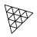
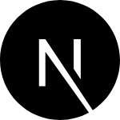

# Hey, I'm Deven - aka RD 👋 

## I make web apps, mobile apps, and games!!

- Building [https://bloomers.tv](https://bloomers.tv) (1.5k+ mau) open source streaming platform on lens , [Twitter](https://x.com/bloomerstv) 
- Raising a [Hand](https://handprotocol.org)
- 🔭 Built & grew DiverseHQ (5k+ users).
- 👯 I’m also working on many other web3 open-source projects. 
- ⚡ Things I like: Books, anime and gaming

### Connect with me:

[Twitter](https://twitter.com/devenrathodrd) &nbsp;&nbsp;
[Linkedin](https://www.linkedin.com/in/deven-rathod-475b39205/)  &nbsp;&nbsp;
[Telegram](https://t.me/devenrathodrd)  &nbsp;&nbsp;
[Hey](https://hey.xyz/u/rathod)  &nbsp;&nbsp;
[Youtube](https://www.youtube.com/channel/UCWpwlcadgurpj8lRlBE_C8w)  &nbsp;&nbsp;

### Languages and Tools:

 
 

